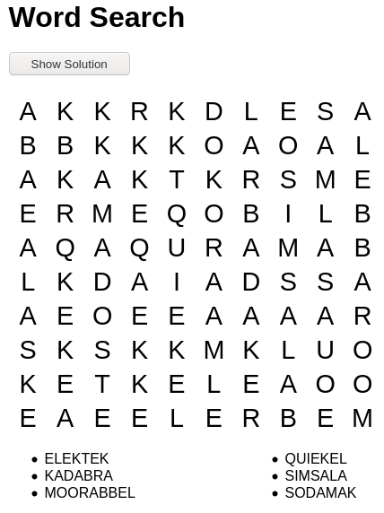
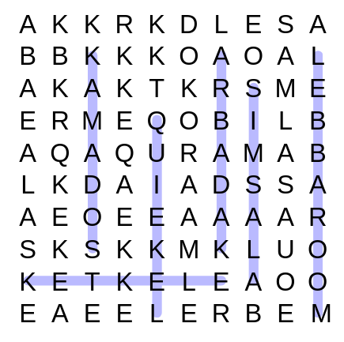

wordsearch
==========

Word Search creation in Perl. Renders on the command line as pure
text but also as HTML with unfolding solution. The latter can also
be rendered as SVG.


```
Usage: ./wordsearch.pl [OPTION] 
Creates a word search puzzle.

 --size        Size of the grid (default=40).
 --directions    Directions to place words (default=8).
        (Diagonals and reverse words = 8, No diagonals = 4,
         No reverse words = 2)
 --words    Number of words to select (default=50)
 --fillwithquote
        Use last word of wordfile as a quote to fill in leftover spaces
        (Otherwise use random letters [the default])
 --righttoleft    Fill in right-to-left (applies only when fillwithquote is true)
 --lowercase    Change all letters to indicated case: upper (default),
        lower, or none (no change).
 --checkunique    Check that each word is found only once in the grid
        (default=0).
 --wordfile    Read words from a file instead of from default location.
        (Currently /usr/share/dict/words)
 --similarwords    Allow words that are similar to each other
        (default=0)
 --minwordlength Minimum word length to check for similarity
        (default=5)
 --all        Use all words from the list of words provided.
         (DO NOT USE THIS WITH THE DEFAULT WORD LIST LOCATION!)
 --nonormalize    Don't try to normliaze the input file
        (useful for number searches)
 --nosolution    Don't display the solution.
 --svg        Use SVG to display the solution 
        (ignored if --nosolution is used).
 --nogrow    Don't grow the grid to find a solution.
 --quick    Iterate one time through before trying new parameters.
 --thorough    Iterate many more times through before trying new parameters.
 --debug    Display debugging output.
 --version    Display the version number.
 --help        Display this help file.
```




