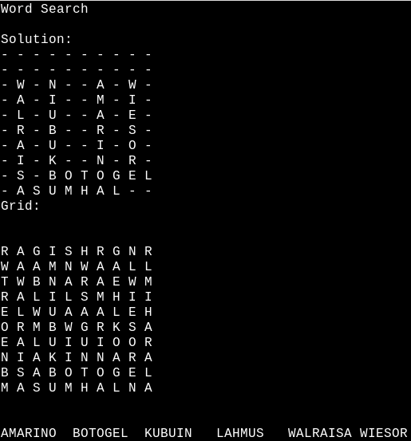

# Wordsearch

WORD SEARCH
By Craig Maloney et al (see CHANGELOG for complete details)
([http://decafbad.net](http://decafbad.net))

## INTRODUCTION

Word Search creation in Perl. Renders on the command line as pure
text but also as HTML with unfolding solution. The latter can also
be rendered as SVG.



This application creates word search puzzles for your enjoyment (frustration?).
It is written in Perl. It will first select the words, generate the puzzle, 
and output the puzzle, the word list, and the solution. 

## INSTALLATION
Copy the wordsearch.pl to a location you wish to run. 
Use `chmod 755 wordsearch.pl` to make it executable. 

Ensure you have the following file on your system: /usr/share/dict/words.

	If your system word list is not in this location, modify wordsearch.pl
	and put in the location of your word list. wordsearch.pl will use this
	file by default for puzzles that don't specify a word list.

Run `wordsearch.pl` and enjoy your new puzzle! You can direct it to a printer or
a file for later printing.

Use `wordsearch.pl --help` for more help.

## NUMBER SEARCHES

Andraž "ruskie" Levstik from the [Source Mage](http://www.sourcemage.org/)
project suggested using WordSearch for creating number searches. I wrote up a
quick random number generator, and modified wordsearch to allow numbers to be
put into the program. Here's the command lines to create what I think is a
pretty good number search:

```
numbergenerator.pl
wordsearch.pl --wordfile random_numbers --similarwords --all --nonormalize
```

If you're really devious, `--nosolution` is also recommended.

Please let me know if you enjoy this program, or if you have any patches or
comments. 

## Invocation

```
Usage: ./wordsearch.pl [OPTION] 
Creates a word search puzzle.

 --size        Size of the grid (default=40).
 --directions    Directions to place words (default=8).
        (Diagonals and reverse words = 8, No diagonals = 4,
         No reverse words = 2)
 --words    Number of words to select (default=50)
 --fillwithquote
        Use last word of wordfile as a quote to fill in leftover spaces
        (Otherwise use random letters [the default])
 --righttoleft    Fill in right-to-left (applies only when fillwithquote is true)
 --lowercase    Change all letters to indicated case: upper (default),
        lower, or none (no change).
 --checkunique    Check that each word is found only once in the grid
        (default=0).
 --wordfile    Read words from a file instead of from default location.
        (Currently /usr/share/dict/words)
 --similarwords    Allow words that are similar to each other
        (default=0)
 --minwordlength Minimum word length to check for similarity
        (default=5)
 --all        Use all words from the list of words provided.
         (DO NOT USE THIS WITH THE DEFAULT WORD LIST LOCATION!)
 --nonormalize    Don't try to normliaze the input file
        (useful for number searches)
 --nosolution    Don't display the solution.
 --svg        Use SVG to display the solution 
        (ignored if --nosolution is used).
 --nogrow    Don't grow the grid to find a solution.
 --quick    Iterate one time through before trying new parameters.
 --thorough    Iterate many more times through before trying new parameters.
 --debug    Display debugging output.
 --version    Display the version number.
 --help        Display this help file.
```

Screenshots
-----------

As SVG for further lossless processing:


As HTML with a bit of interaction:


